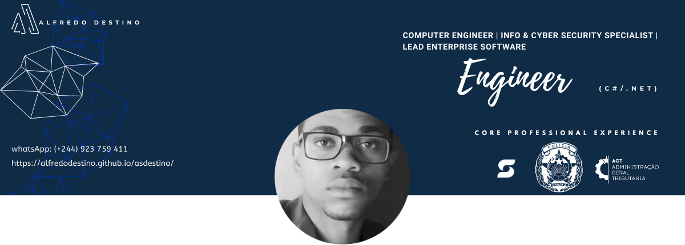
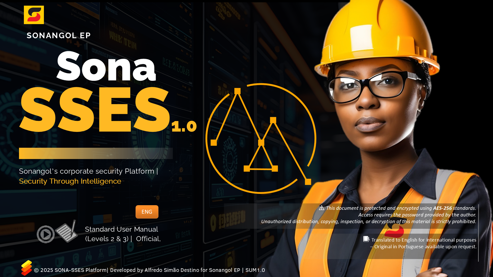
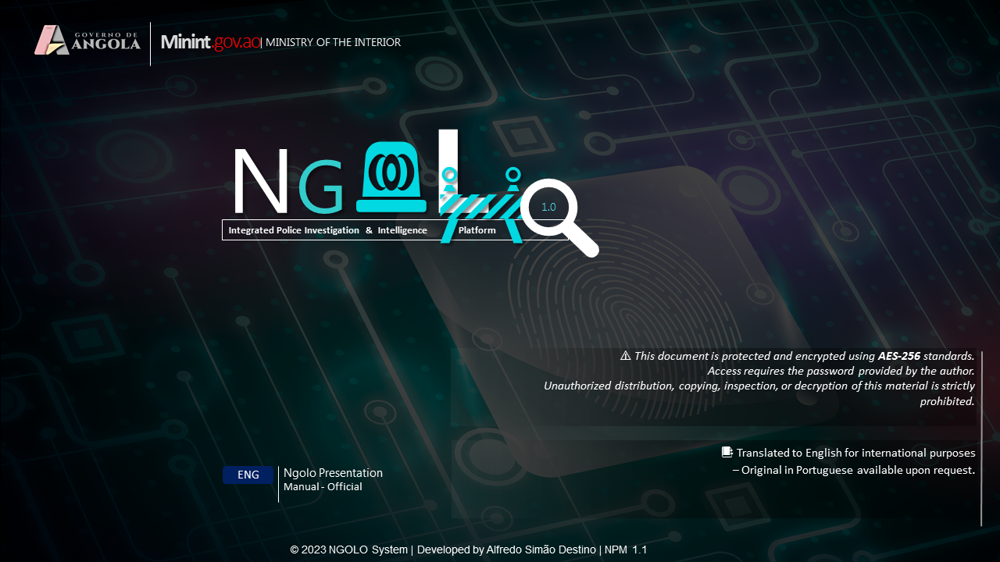
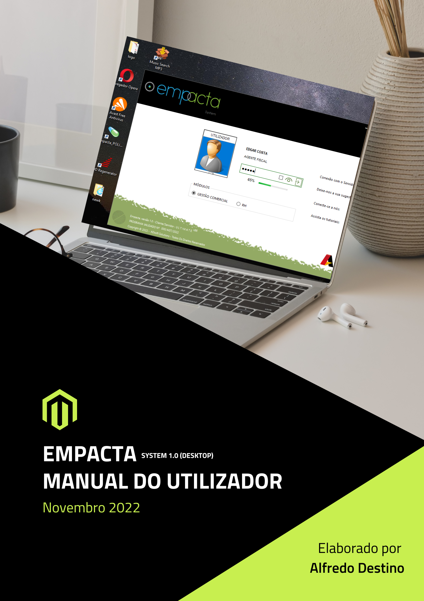

  

<h1 align="center" style="margin-top: -10px; font-weight: 700;">Alfredo Destino</h1>

  <strong>Computer Engineer • Lead Enterprise Software Engineer (C#/.NET) • Information & Cyber Security Specialist • MSc Candidate Switzerland 2026</strong>

 

<!--━━━━━━━━━━━━━━━━━━━━━━━━━━━━━━━━━━━━━━━━━━━━━━━━━━-->
<h2 align="left">👤 ABOUT ME</h2>
<!--━━━━━━━━━━━━━━━━━━━━━━━━━━━━━━━━━━━━━━━━━━━━━━━━━━-->

Computer Engineer and Lead Enterprise Software Developer with 7+ years of hands-on experience designing and deploying secure, mission-critical systems for national institutions in Angola, including [Sonangol EP](https://www.sonangol.co.ao/), the [Ministry of Interior](https://www.minint.gov.ao/), and the [Tax Authority – AGT](http://www.agt.minfin.gov.ao/).

Awarded **Best Student in Programming & Networks (2017–2019)** at Kimpa Vita University.  
Served as Lab Monitor & Lecturer, supporting academic innovation and technical training.

Currently applying for an **MSc in Information & Cyber Security (Switzerland)** — aiming to advance expertise in secure architectures, cryptography, and large-scale security ecosystems.

🔗 **LinkedIn:** [linkedin.com/in/asdestino](https://www.linkedin.com/in/asdestino)

 

<!--━━━━━━━━━━━━━━━━━━━━━━━━━━━━━━━━━━━━━━━━━━━━━━━━━━-->
<h2 align="left">💼 KEY PROJECTS</h2>
<!--━━━━━━━━━━━━━━━━━━━━━━━━━━━━━━━━━━━━━━━━━━━━━━━━━━-->

### 🔐 **Protected PDF Notice**
> ⚠️ Due to the institutional nature of SONA-SSES and NGOLO system, **technical manuals are password-protected** to comply with security and confidentiality requirements.  
> Access is granted only to **authorized reviewers**, included in my MSc application, or upon verified request.

---

## ❏ **SONA-SSES — Sonangol Corporate Security Platform**  
### *([Sonangol EP](https://www.sonangol.co.ao/), 2025–Present)*

- 📘 **Standard User Manual 1.0 — 45 pages (English, Password-Protected)**  

  

  <a href="SONA_SSES_SUM1.0.pdf"><strong>📥 Download PDF</strong></a>

- [🎬 **Intro Video (2 min)**](https://youtu.be/41C7MBI42T4)  
- **Phase 1:** Enterprise security management for 200+ users.  
- **Phase 2:** Secure remote access via **VPN / Zero-Trust (ZTNA)**.  
- **Full demonstration available upon request (classified).**

---

## ❏ **NGOLO — Police Investigation & Intelligence Platform**  
### *([Ministry of Interior](https://www.minint.gov.ao/), 2023–2024)*

- 📘 **Presentation Manual 1.1 — 28 pages (English, Password-Protected)**  

  

  <a href="Apresentação_Ngolo1.1.pdf"><strong>📥 Download PDF</strong></a>

- [**🎬 Ngolo deployment video - 📍in Dande (2 min)**](https://youtube.com/shorts/j7-Q0iAS_RY?si=UBQs7ZpqczXaxV7D)
- Reduced operational response time by **40%** across 10+ distributed units.  
- Nationwide expansion (ZTNA/VPN) planned as MSc research component.

---

## ❏ **EMPACTA — Commercial & Billing System**  
### *([AGT](http://www.agt.minfin.gov.ao/), 2022)*

- 📃✔️ **AGT Validation Certificate nº 388/2022**  
  [Download PDF](agtasd.pdf)
  
- [**🎬 Client Demo Video (6 min)— 🚗 Auto Jumek / Luanda province**](https://www.youtube.com/watch?v=chE4cHQUZjs)  

- [**🎬 Client Demo Video (5 min)— 💊 Valemat / Bengo province**](https://www.youtube.com/watch?v=6SgwtPZ5Itw)
  
- 📘 **User Manual 1.0 — 75 pages (Portuguese)**  

  

  <a href="EMPACTA_Manual_do_Utilizador.pdf"><strong>📥 Download PDF</strong></a>

- Processes **1,000+ invoices/month** across multiple companies.  
- Full ERP: sales, stock, taxation, reporting, SAFT integration.

 

<!--━━━━━━━━━━━━━━━━━━━━━━━━━━━━━━━━━━━━━━━━━━━━━━━━━━-->
<h2 align="left">💎 SKILLS OVERVIEW</h2>
<!--━━━━━━━━━━━━━━━━━━━━━━━━━━━━━━━━━━━━━━━━━━━━━━━━━━-->

### **Programming**
C#, .NET (WinForms/WPF), SQL, MySQL, Batch, Systems Architecture  

### **Cyber Security & Networks**
VPN, ZTNA, RBAC, Encryption, DLP, Secure Architecture, Compliance, Auditing  

### **Tools**
Visual Studio, Git/GitHub, XAMPP, Crystal Reports, MS Visio, Cisco Packet Tracer, GNS3, OpenSSL  

 

<!--━━━━━━━━━━━━━━━━━━━━━━━━━━━━━━━━━━━━━━━━━━━━━━━━━━-->
<h2 align="left">📱 CONTACT</h2>
<!--━━━━━━━━━━━━━━━━━━━━━━━━━━━━━━━━━━━━━━━━━━━━━━━━━━-->

📨 **Email:** [alfredodestinn@gmail.com](mailto:alfredodestinn@gmail.com)  
📲 **Phone:** +244-945-380-783  
💬 **WhatsApp:** [Message Me](https://wa.me/244923759411?text=Hello%20Mr.%20Alfredo%2C%0AI'm%20contacting%20you%20from%20your%20GitHub%20portfolio...)

 
<!--━━━━━━━━━━━━━━━━━━━━━━━━━━━━━━━━━━━━━━━━━━━━━━━━━━-->
<h2 align="center">🌱</h2>
<!--━━━━━━━━━━━━━━━━━━━━━━━━━━━━━━━━━━━━━━━━━━━━━━━━━━-->

  <em>“Together we can.” — Helen Keller</em>

